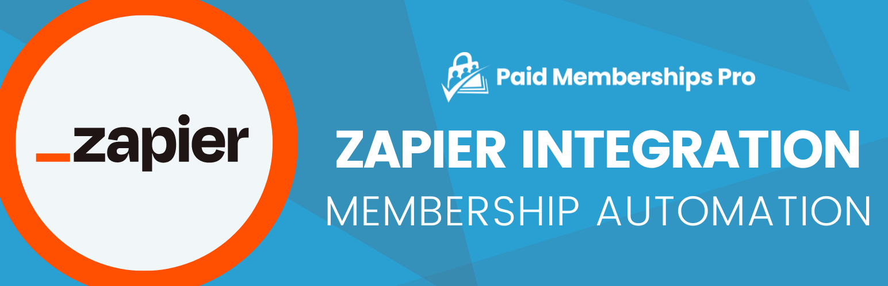

# [Paid Memberships Pro – Zapier Add On](https://www.paidmembershipspro.com/add-ons/pmpro-zapier/) #
[comment]: # (Generate badges from shields.io, only works for .org plugins to get other stats etc. We'd have to create our own endpoints for Premium plugins)

### Welcome to the Paid Memberships Pro – Zapier Add On GitHub Repository
Integrate activity on your membership site with thousands of other apps via Zapier (requires Paid Memberships Pro).

**Update: PMPro v2.6+ introduced native support for Zapier without the need for this Add On. [Read the documentation on core Zapier compatibility to get started](https://www.paidmembershipspro.com/documentation/compatibility/zapier/). This native integration allows multiple events for each action and trigger, which was a previous limitation of the Add On’s webhook methods.**

For more information please visit [www.paidmembershipspro.com/add-ons/pmpro-zapier/](https://www.paidmembershipspro.com/add-ons/pmpro-zapier/)

## Installation ##
For detailed installation steps, visit the [documentation](https://www.paidmembershipspro.com/add-ons/pmpro-zapier/) page.

1. Download the current development ZIP file directly: `https://github.com/strangerstudios/pmpro-zapier/archive/dev.zip`

**Please ensure that once installing this version of the plugin to remove `-dev` from the plugin's folder name.**

## Bugs ##
If you find an issue/bug, let us know by [creating a detailed GitHub issue](https://github.com/strangerstudios/pmpro-zapier/issues/new).

## Support ##
This is a developer's portal for Paid Memberships Pro – Zapier Add On. We do not offer support on this channel. **Any support related questions should be directed to [www.paidmembershipspro.com/add-ons/pmpro-zapier/](https://www.paidmembershipspro.com/add-ons/pmpro-zapier/).**

## Contributing to Paid Memberships Pro – Zapier Add On ##
We encourage and welcome any contribution to Paid Memberships Pro – Zapier Add On. Please read the [guidelines for contributing](https://github.com/strangerstudios/pmpro-zapier/blob/dev/.github/CONTRIBUTING.md) to this repository.

There are various **ways to the help development** of Paid Memberships Pro – Zapier Add On:

1. Report [bugs/issues](https://github.com/strangerstudios/pmpro-zapier/issues/new) on GitHub.
2. Work on any issues by submitting a Pull Request.

Here are some ways for **non-developers to contribute** to Paid Memberships Pro – Zapier Add On:

1. Translate Paid Memberships Pro – Zapier Add On into your own [language](https://www.paidmembershipspro.com/paid-memberships-pro-in-your-language/).
2. [Purchase a plus membership](https://paidmembershipspro.com/pricing) to help fund ongoing development and bug fixes.
3. Leave an honest review for [Paid Memberships Pro – Zapier Add On](https://www.paidmembershipspro.com/submit-testimonial/).